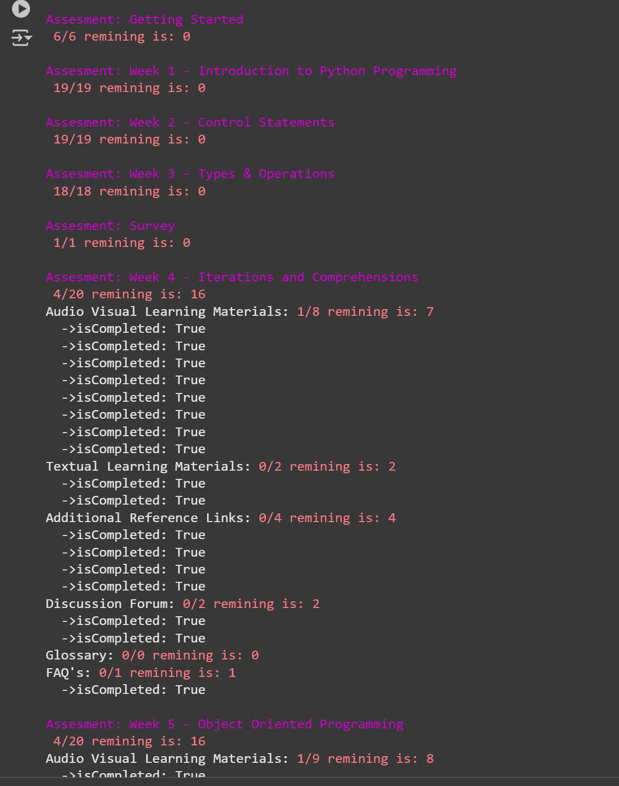

# SRM LMS Automation Tool

## Overview
The **SRM LMS Automation Tool** is designed to streamline and enhance the user experience of the **SRM Learning Management System (LMS)** by automating repetitive tasks such as assignment submissions. This tool aims to reduce manual effort, improve efficiency, and provide seamless interaction with SRM LMS.

## Features
- **Automated Login**: Secure and quick access to the LMS without repeated manual authentication.

- **Assignment Submission**:
  - **Audio visual learning materials**
  - **Textual Learning Materials**
  - **Additional Reference Links**
  - **Glossary**
  - **FAQs**

    
## Benefits
- **Saves Time**: Eliminates the need for manual interaction with repetitive LMS tasks.
- **Reduces Errors**: Minimizes the chances of missing deadlines or incorrect 


## Installation -requirements
- Install Dependencies
  ```shell
    pip install requests
## Code Example
- Update the username, password, and subject selection logic in the **main.py** file.
  ```shell
  LMS = srm_lms_dashboard.LMS("US1234", "passWORD")
  LMS.Activity(LMS.PYTHON_PROGRAMING).CompleteAllWeeks()
- Run this file in the Python shell.
    ```shell
    python main.py
## You will replace the Subject 
-   ANDROIED_APPLICATION_DEVELOPMENT
-   CAREER_ADVANCEMENT 
-   DATA_ANALYSING_USING_R 
-   OPTIMIZATION_TECHNIQUES 
-   CUMPUTER_NETWORKS 
-   PYTHON_PROGRAMING 

## Final Output 
